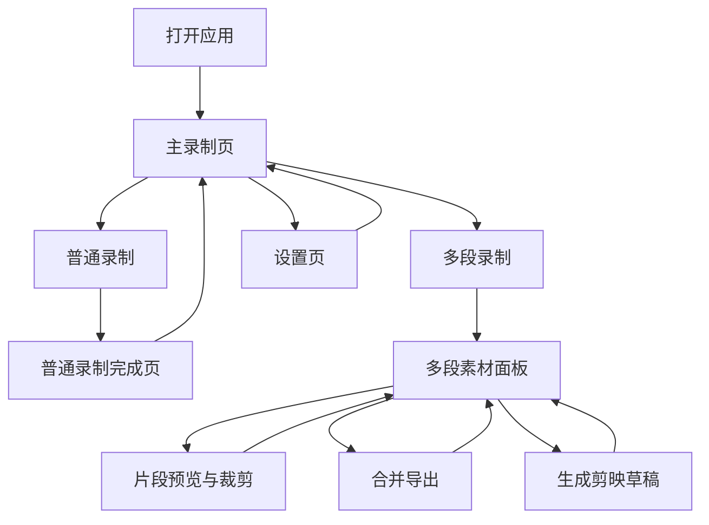

# 简录制器页面线框图

说明：以下为 MVP 页面线框图，重点表达布局、信息层级和操作入口，不代表最终视觉样式。

## 1. 主录制页

适用场景：用户进入产品后的默认页面，支持普通录制和多段录制。

```text
┌──────────────────────────────────────────────────────────────────────────────┐
│ 简录制器                                               [设置] [最小化] [关闭] │
├──────────────────────────────────────────────────────────────────────────────┤
│ 录制模式  [ 普通录制 | 多段录制 ]                                             │
│ 保存位置  D:\Recordings\简录制器                         [更改目录] [打开] │
│ 录制源    [整个屏幕 v]    范围 [16:9 v]    音频 [系统+麦克风 v]              │
│ 画质      [1080p / 30fps v]                                                  │
├──────────────────────────────────────────────────────────────────────────────┤
│                                                                              │
│                           当前录制源预览区域                                  │
│                                                                              │
│              ┌──────────────────────────────────────────────┐                │
│              │                                              │                │
│              │              屏幕 / 窗口预览画面              │                │
│              │        ┌────────────────────────────┐        │                │
│              │        │        录制范围裁切框        │        │                │
│              │        └────────────────────────────┘        │                │
│              └──────────────────────────────────────────────┘                │
│                                                                              │
│                         状态：待录制    00:00:00                              │
│                                                                              │
├──────────────────────────────────────────────────────────────────────────────┤
│                         [开始录制]  [取消]                                    │
└──────────────────────────────────────────────────────────────────────────────┘
```

录制中状态：

```text
┌──────────────────────────────────────────────────────────────────────────────┐
│ 简录制器                                                ● 正在录制 00:03:28 │
├──────────────────────────────────────────────────────────────────────────────┤
│ 录制模式  普通录制 / 多段录制                                                 │
│ 保存位置  D:\Recordings\简录制器                                            │
│ 录制源    整个屏幕      范围 16:9      音频 系统+麦克风      画质 1080p / 30fps│
├──────────────────────────────────────────────────────────────────────────────┤
│                                                                              │
│                           当前录制源预览区域                                  │
│                                                                              │
├──────────────────────────────────────────────────────────────────────────────┤
│                    [暂停]  [停止录制]  [取消本次录制]                         │
└──────────────────────────────────────────────────────────────────────────────┘
```

暂停状态：

```text
┌──────────────────────────────────────────────────────────────────────────────┐
│ 简录制器                                                II 已暂停 00:03:28   │
├──────────────────────────────────────────────────────────────────────────────┤
│                                                                              │
│                           当前录制源预览区域                                  │
│                                                                              │
├──────────────────────────────────────────────────────────────────────────────┤
│                    [继续录制]  [停止录制]  [取消本次录制]                      │
└──────────────────────────────────────────────────────────────────────────────┘
```

录制范围预设选择：

```text
┌──────────────────────────────────────────────────────────────────────────────┐
│ 录制范围                                                                     │
│                                                                              │
│ ┌──────────────┐ ┌──────────────┐ ┌──────────────┐                           │
│ │    16:9      │ │     4:3      │ │     3:4      │                           │
│ │   YouTube    │ │    经典      │ │   小红书     │                           │
│ └──────────────┘ └──────────────┘ └──────────────┘                           │
│ ┌──────────────┐ ┌──────────────┐ ┌──────────────┐                           │
│ │     9:16     │ │     1:1      │ │   Custom     │                           │
│ │    抖音      │ │   正方形     │ │   自定义     │                           │
│ └──────────────┘ └──────────────┘ └──────────────┘                           │
│                                                                              │
│ Custom 参数：X [____]  Y [____]  宽 [____]  高 [____]                         │
│                                                                              │
│                         [设为默认]  [应用]                                    │
└──────────────────────────────────────────────────────────────────────────────┘
```

## 2. 普通录制完成页

适用场景：普通录制停止后，展示保存结果。

```text
┌──────────────────────────────────────────────────────────────────────────────┐
│ 简录制器                                                                   │
├──────────────────────────────────────────────────────────────────────────────┤
│                                                                              │
│                         录制完成                                             │
│                                                                              │
│     文件名       recording_20260513_172800.mp4                               │
│     时长         00:08:32                                                     │
│     大小         186 MB                                                       │
│     保存位置     D:\Recordings\简录制器\recording_20260513_172800.mp4       │
│                                                                              │
│     ┌──────────────────────────────────────────────────────────────────┐     │
│     │                         视频预览                                  │     │
│     └──────────────────────────────────────────────────────────────────┘     │
│                                                                              │
│              [打开文件位置]  [重新录制]  [返回首页]                           │
│                                                                              │
└──────────────────────────────────────────────────────────────────────────────┘
```

## 3. 多段录制页

适用场景：用户选择多段录制，录完每段后自动进入素材面板。

```text
┌──────────────────────────────────────────────────────────────────────────────┐
│ 简录制器                                      项目：未命名项目     [设置]   │
├──────────────────────────────────────────────┬───────────────────────────────┤
│ 录制模式  [ 普通录制 | 多段录制 ]             │ 素材面板                       │
│ 保存位置  D:\Recordings\项目A   [更改目录]    │ 片段 3 个    总时长 00:05:42    │
│ 录制源    [整个屏幕 v]                        │                               │
│ 录制范围  [16:9 v]                            │ ┌───────────────────────────┐ │
│ 音频      [系统+麦克风 v]                     │ │ 01  开场说明               │ │
│ 画质      [1080p / 30fps v]                   │ │ [缩略图] 00:01:12  已确认  │ │
│                                              │ │ [预览] [裁剪] [重命名] [删] │ │
│                                              │ └───────────────────────────┘ │
│                                              │ ┌───────────────────────────┐ │
│              当前录制源预览区域               │ │ 02  功能演示               │ │
│                                              │ │ [缩略图] 00:03:08  待处理  │ │
│                                              │ │ [预览] [裁剪] [重命名] [删] │ │
│                                              │ └───────────────────────────┘ │
│                                              │ ┌───────────────────────────┐ │
│                                              │ │ 03  结尾                   │ │
│                                              │ │ [缩略图] 00:01:22  已确认  │ │
│                                              │ │ [预览] [裁剪] [重命名] [删] │ │
│                                              │ └───────────────────────────┘ │
├──────────────────────────────────────────────┼───────────────────────────────┤
│ [开始录制下一段] [暂停] [停止] [取消本段]      │ [合并导出] [生成剪映草稿]       │
└──────────────────────────────────────────────┴───────────────────────────────┘
```

素材为空状态：

```text
┌───────────────────────────────┐
│ 素材面板                       │
│ 片段 0 个    总时长 00:00:00    │
│                               │
│      还没有录制片段             │
│      点击左侧开始录制第一段      │
│                               │
│      [开始录制第一段]            │
└───────────────────────────────┘
```

## 4. 片段预览与裁剪弹窗

适用场景：用户点击某段素材的「预览」或「裁剪」。

```text
┌──────────────────────────────────────────────────────────────────────────────┐
│ 片段预览与裁剪                                      segment_002.mp4    [关闭] │
├──────────────────────────────────────────────────────────────────────────────┤
│                                                                              │
│     ┌──────────────────────────────────────────────────────────────────┐     │
│     │                                                                  │     │
│     │                            视频预览                              │     │
│     │                                                                  │     │
│     └──────────────────────────────────────────────────────────────────┘     │
│                                                                              │
│     00:00:00 ━━━━━━━●━━━━━━━━━━━━━━━━━━━━━━━━━━━━━━━━━━━━ 00:03:08             │
│                                                                              │
│     入点  [00:00:04.200]        出点  [00:02:58.600]                          │
│                                                                              │
│     片段名称  [ 功能演示                                      ]               │
│     备注      [ 这里重录过一次，保留第二版                    ]               │
│                                                                              │
│                         [恢复原始]  [保存裁剪]  [取消]                        │
│                                                                              │
└──────────────────────────────────────────────────────────────────────────────┘
```

## 5. 合并导出弹窗

适用场景：用户希望把多段素材导出为一个 mp4。

```text
┌──────────────────────────────────────────────────────────────────────────────┐
│ 合并导出                                                             [关闭]   │
├──────────────────────────────────────────────────────────────────────────────┤
│ 导出文件名  [ final_20260513_180000.mp4                         ]            │
│ 导出位置    D:\Recordings\项目A\exports                         [更改目录]   │
│                                                                              │
│ 将按以下顺序合并：                                                            │
│                                                                              │
│  01  开场说明        00:01:12                                                 │
│  02  功能演示        00:02:54   已裁剪                                        │
│  03  结尾            00:01:22                                                 │
│                                                                              │
│ 预计总时长  00:05:28                                                          │
│                                                                              │
│                         [开始导出]  [取消]                                    │
└──────────────────────────────────────────────────────────────────────────────┘
```

导出中状态：

```text
┌──────────────────────────────────────────────────────────────────────────────┐
│ 合并导出                                                             [关闭]   │
├──────────────────────────────────────────────────────────────────────────────┤
│ 正在导出 final_20260513_180000.mp4                                           │
│                                                                              │
│ 进度  ████████████████████░░░░░░░░░░  68%                                    │
│                                                                              │
│ 当前步骤：合并第 2 / 3 个片段                                                  │
│                                                                              │
│                         [后台执行]  [取消导出]                                │
└──────────────────────────────────────────────────────────────────────────────┘
```

## 6. 生成剪映草稿弹窗

适用场景：用户希望把多段录制结果直接生成剪映草稿。

```text
┌──────────────────────────────────────────────────────────────────────────────┐
│ 生成剪映草稿                                                         [关闭]   │
├──────────────────────────────────────────────────────────────────────────────┤
│ 草稿名称      [ 项目A_录制草稿                                  ]             │
│ 草稿位置      D:\剪映输出物\JianyingPro Drafts                  [更改目录]    │
│                                                                              │
│ 视频设置      1920 x 1080    30 fps                                           │
│ 素材来源      D:\Recordings\项目A\recordings                                  │
│ 片段数量      3 个                                                            │
│ 点击事件      已检测到 2 个 _events.json                                      │
│                                                                              │
│ 将生成：                                                                     │
│  - 剪映草稿                                                                  │
│  - jianying_project_config.json                                               │
│  - 生成日志                                                                  │
│                                                                              │
│                         [生成草稿]  [取消]                                    │
└──────────────────────────────────────────────────────────────────────────────┘
```

生成成功状态：

```text
┌──────────────────────────────────────────────────────────────────────────────┐
│ 生成剪映草稿                                                                 │
├──────────────────────────────────────────────────────────────────────────────┤
│                                                                              │
│                         剪映草稿已生成                                        │
│                                                                              │
│ 草稿名称  项目A_录制草稿                                                      │
│ 草稿位置  D:\剪映输出物\JianyingPro Drafts\项目A_录制草稿                     │
│ 配置文件  D:\Recordings\项目A\drafts\jianying_project_config.json             │
│                                                                              │
│                  [打开草稿目录]  [打开配置文件位置]  [返回]                   │
│                                                                              │
└──────────────────────────────────────────────────────────────────────────────┘
```

生成失败状态：

```text
┌──────────────────────────────────────────────────────────────────────────────┐
│ 生成剪映草稿                                                                 │
├──────────────────────────────────────────────────────────────────────────────┤
│                                                                              │
│                         生成失败                                             │
│                                                                              │
│ 原因：素材文件缺失或剪映草稿目录不可写                                        │
│                                                                              │
│ 已保留：                                                                     │
│  - jianying_project_config.json                                               │
│  - generate.log                                                               │
│                                                                              │
│                  [查看日志]  [重新生成]  [返回]                               │
│                                                                              │
└──────────────────────────────────────────────────────────────────────────────┘
```

## 7. 设置页

适用场景：配置默认保存路径、音频、画质、事件记录和 ffmpeg。

```text
┌──────────────────────────────────────────────────────────────────────────────┐
│ 设置                                                                 [返回]   │
├──────────────────────────────────────────────────────────────────────────────┤
│ 基础设置                                                                     │
│ 默认保存位置  D:\Recordings\简录制器                         [更改目录]    │
│ 文件命名规则  [ recording_YYYYMMDD_HHmmss                       ]            │
│                                                                              │
│ 录制设置                                                                     │
│ 默认录制源    [整个屏幕 v]                                                    │
│ 默认录制范围  [16:9 YouTube v]                                                │
│ 自定义范围    X [0]  Y [0]  宽 [1920]  高 [1080]                              │
│ 默认音频      [系统声音 + 麦克风 v]                                           │
│ 默认分辨率    [原始 v]                                                        │
│ 默认帧率      [30 fps v]                                                      │
│ 默认码率      [自动 v]                                                        │
│                                                                              │
│ 事件记录                                                                     │
│ [x] 记录鼠标点击事件                                                         │
│ [ ] 记录鼠标移动轨迹                                                         │
│ [x] 生成同名 _events.json                                                    │
│                                                                              │
│ 外部工具                                                                     │
│ ffmpeg 状态   已检测到 ffmpeg                                  [重新检测]    │
│ ffmpeg 路径   C:\ffmpeg\bin\ffmpeg.exe                         [手动选择]    │
│                                                                              │
│                         [保存设置]  [恢复默认]                                │
└──────────────────────────────────────────────────────────────────────────────┘
```

## 8. 页面流转关系



